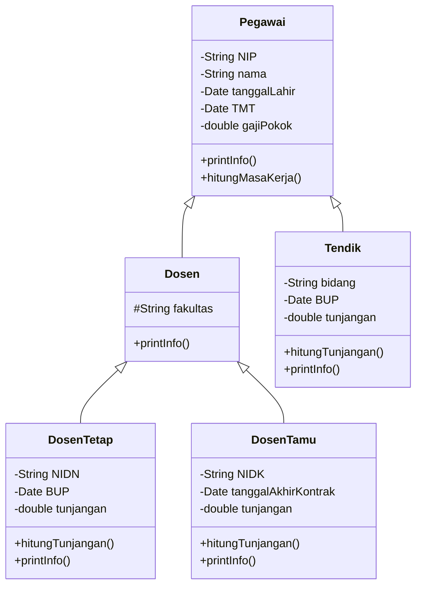

```mermaid
classDiagram
    Pegawai <|-- Dosen
    Pegawai <|-- Tendik
    Dosen <|-- DosenTetap
    Dosen <|-- DosenTamu
    
    class Pegawai {
        -String NIP
        -String nama
        -Date tanggalLahir
        -Date TMT
        -double gajiPokok
        +printInfo()
        +hitungMasaKerja()
    }
    
    class Dosen {
        #String fakultas
        +printInfo()
    }
    
    class DosenTetap {
        -String NIDN
        -Date BUP
        -double tunjangan
        +hitungTunjangan()
        +printInfo()
    }
    
    class DosenTamu {
        -String NIDK
        -Date tanggalAkhirKontrak
        -double tunjangan
        +hitungTunjangan()
        +printInfo()
    }
    
    class Tendik {
        -String bidang
        -Date BUP
        -double tunjangan
        +hitungTunjangan()
        +printInfo()
    }
```