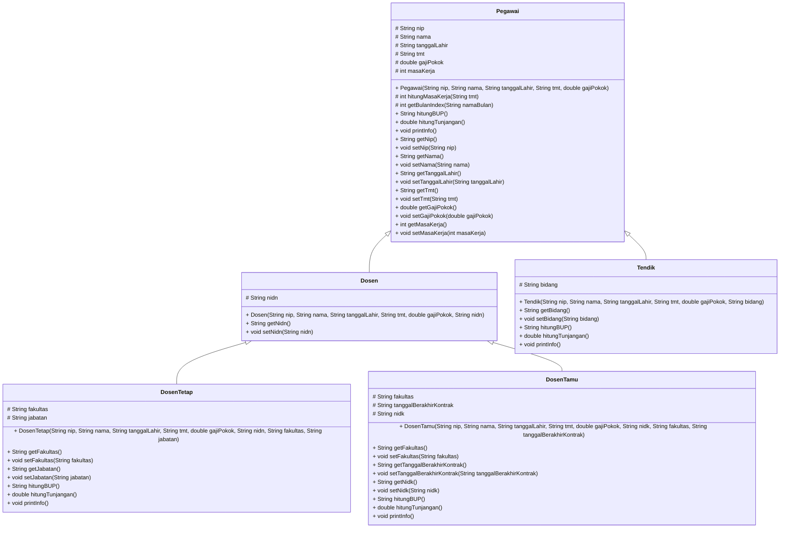

```mermaid
classDiagram
    Pegawai <|-- Dosen
    Pegawai <|-- Tendik
    Dosen <|-- DosenTetap
    Dosen <|-- DosenTamu
    
    class Pegawai {
        # String nip
        # String nama
        # String tanggalLahir
        # String tmt
        # double gajiPokok
        # int masaKerja

        + Pegawai(String nip, String nama, String tanggalLahir, String tmt, double gajiPokok)
        # int hitungMasaKerja(String tmt)
        # int getBulanIndex(String namaBulan)
        + String hitungBUP()
        + double hitungTunjangan()
        + void printInfo()
        + String getNip()
        + void setNip(String nip)
        + String getNama()
        + void setNama(String nama)
        + String getTanggalLahir()
        + void setTanggalLahir(String tanggalLahir)
        + String getTmt()
        + void setTmt(String tmt)
        + double getGajiPokok()
        + void setGajiPokok(double gajiPokok)
        + int getMasaKerja()
        + void setMasaKerja(int masaKerja)
    }
    
    class Dosen {
        # String nidn

        + Dosen(String nip, String nama, String tanggalLahir, String tmt, double gajiPokok, String nidn)
        + String getNidn()
        + void setNidn(String nidn)
    }
    
    class DosenTetap {
        # String fakultas
        # String jabatan

        + DosenTetap(String nip, String nama, String tanggalLahir, String tmt, double gajiPokok, String nidn, String fakultas, String jabatan)
        + String getFakultas()
        + void setFakultas(String fakultas)
        + String getJabatan()
        + void setJabatan(String jabatan)
        + String hitungBUP()
        + double hitungTunjangan()
        + void printInfo()
    }
    
    class DosenTamu {
        # String fakultas
        # String tanggalBerakhirKontrak
        # String nidk

        + DosenTamu(String nip, String nama, String tanggalLahir, String tmt, double gajiPokok, String nidk, String fakultas, String tanggalBerakhirKontrak)
        + String getFakultas()
        + void setFakultas(String fakultas)
        + String getTanggalBerakhirKontrak()
        + void setTanggalBerakhirKontrak(String tanggalBerakhirKontrak)
        + String getNidk()
        + void setNidk(String nidk)
        + String hitungBUP()
        + double hitungTunjangan()
        + void printInfo()
    }
    
    class Tendik {
        # String bidang

        + Tendik(String nip, String nama, String tanggalLahir, String tmt, double gajiPokok, String bidang)
        + String getBidang()
        + void setBidang(String bidang)
        + String hitungBUP()
        + double hitungTunjangan()
        + void printInfo()
    }
```