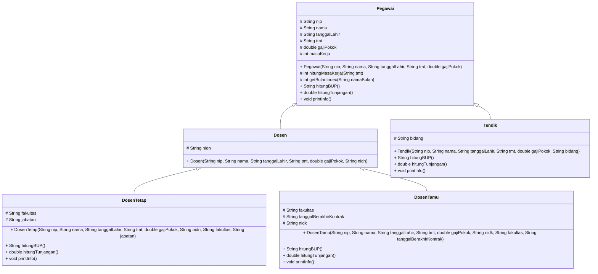

```mermaid
classDiagram
    Pegawai <|-- Dosen
    Pegawai <|-- Tendik
    Dosen <|-- DosenTetap
    Dosen <|-- DosenTamu
    
    class Pegawai {
        # String nip
        # String nama
        # String tanggalLahir
        # String tmt
        # double gajiPokok
        # int masaKerja
        
        + Pegawai(String nip, String nama, String tanggalLahir, String tmt, double gajiPokok)
        # int hitungMasaKerja(String tmt)
        # int getBulanIndex(String namaBulan)
        + String hitungBUP()
        + double hitungTunjangan()
        + void printInfo()
    }
    
    class Dosen {
        # String nidn

        + Dosen(String nip, String nama, String tanggalLahir, String tmt, double gajiPokok, String nidn)
    }
    
    class DosenTetap {
        # String fakultas
        # String jabatan

        + DosenTetap(String nip, String nama, String tanggalLahir, String tmt, double gajiPokok, String nidn, String fakultas, String jabatan)
        + String hitungBUP()
        + double hitungTunjangan()
        + void printInfo()
    }
    
    class DosenTamu {
        # String fakultas
        # String tanggalBerakhirKontrak
        # String nidk

        + DosenTamu(String nip, String nama, String tanggalLahir, String tmt, double gajiPokok, String nidk, String fakultas, String tanggalBerakhirKontrak)
        + String hitungBUP()
        + double hitungTunjangan()
        + void printInfo()
    }
    
    class Tendik {
        # String bidang

        + Tendik(String nip, String nama, String tanggalLahir, String tmt, double gajiPokok, String bidang)
        + String hitungBUP()
        + double hitungTunjangan()
        + void printInfo()
    }
```